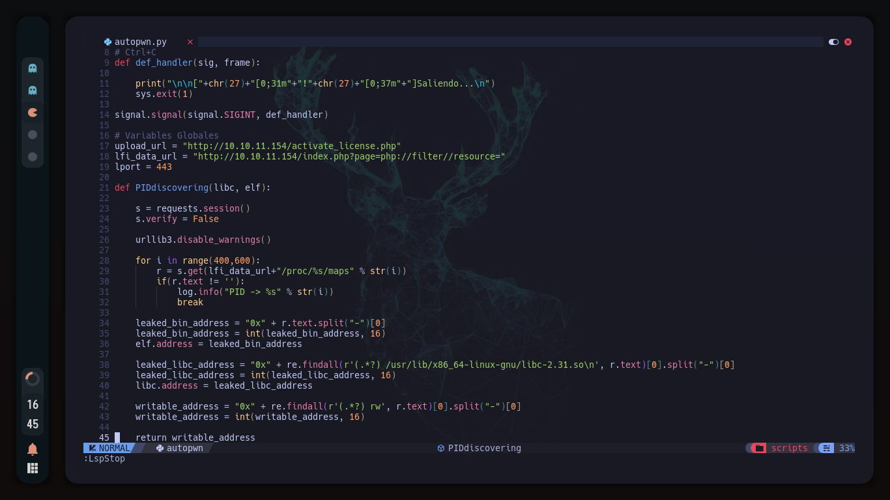

# Index

- [**Screenshots**](#Screenshots)
- [**Introduction**](#Introduction)
- [**Pre-requisites**](#Pre-requisites)
- [**Installation**](#Installation)

# Screenshots

<p align="left">
	<a href="./images/dashboard.png" target="_blank">
		
	</a>
</p>

<p align="right">
	<a href="./images/python_example.png" target="_blank">
		
	</a>
</p>


# Introduction

This repository is a little guide to recreate my workspace, with the previous NvChad config for nvim.
This config for nvim has:

- Custom highlighting for lua and python. 
- Installed LSP servers for php, lua and bash
- More plugins than NvChad's default plugins like:    
  - **Nvim-ts-rainbow** *A Treesitter module which helps to identify brackets with colors in your workspace*
  - **Treesitter playground** *Another module which helps you to identify highlightings, its usefull to make own colorschemes*
  - **KNAP** *Plugin which allows you to make live debugging .texfiles and .md files*
  - **Startup nvim** *A plugin which gives a initial nvim's dashboard*

# Pre-requisites

First of all we need the NvChad's config, you can install and learn how to customize it from [**here**](https://nvchad.github.io/)
All requirements for my config are:

# Installation

You only need to copy the custom folder into your `~/.config/nvim/lua/` folder and make the following steps:

- Only if you want bashls as LSP server:

  `paru -S shellcheck`

- Dependencies for KNAP:


  ```
  paru -S sioyek
  paru -S falkon
  paru -S rubber
  pacman -Sy texlive
  pacman -Sy texlive-core
  paru -S texlive-humanities
  ```

> Note that im using ArchLinux, so you need to adjust the commands for your distro, as the name of the packages. 
But thats only for the default config of this plugin, you can read the documentation of the plugin here and set your custom config with any browseror pdfviewer.


